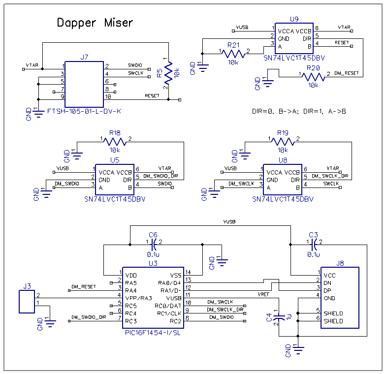

an engineer's introduction to implementing CMSIS-DAP 
====================================================

Copyright (C) 2016 Peter Lawrence.  All Rights Reserved.  This is distributed on an "AS IS" BASIS, WITHOUT WARRANTIES OR CONDITIONS OF ANY KIND, either express or implied.
    
## Introduction

ARM microcontrollers typically include on-chip debugging functionality; however, an external debug unit (also called programming/debugging "pod") must be connected to harness this capability.

This app note targets an engineer considering integrating such programming/debugging functionality into an evaluation board or other product.  The app note may also be of interest to those considering also using this built-in USB functionality to provide additional capability for factory testing and/or field upgrades.  If these options hold appeal, it is worth considering incorporating an inexpensive CMSIS-DAP debug unit implementation into your design.

ARM promulgated the CMSIS-DAP specification to provide a standardized means of debugging ARM targets from a variety of PC operating systems and development software.

With the availability of inexpensive USB microcontrollers like the Microchip PIC16F145x, STMicro STM32F0x2, and Atmel ATSAMD11 (or indeed any other USB microcontroller that might already be included in your hardware), integrating a CMSIS-DAP debug unit is achievable at minimal cost.

To understand what a debug unit does, one must first know what it connects to.

## JTAG and SWD

There are two flavors of debug unit interfaces for ARM devices.

The legacy ARM debug unit interface is JTAG.  The JTAG standard was originally intended as a universal industry standard for incorporating boundary-scan testing into integrated circuits.  However, the standard also included a mechanism for vendors to extend it for other purposes.  ARM created such an extension to provide on-chip debugging for its CPU cores.  These JTAG extensions by ARM and others have become so commonplace that "JTAG" may now be more associated with programming/debugging functionality, even though that perhaps was not JTAG's original function.

The more modern ARM debug unit interface is SWD (Serial Wire Debug), and it offers some non-trivial ARM debugging benefits over the legacy JTAG-based implementation.

The most immediate benefit of SWD is that it accomplishes the same debug unit interface functionality with only two signals (SWDIO and SWCK) versus JTAG's five (TCK, TMS, TDO, TDI, and TRST).  An additional benefit is that SWD can send and receive the same data in fewer clock cycles than JTAG, allowing more data to be transferred in the same amount of time.

The elegance of the SWD standard is that its pins can co-exist with the legacy JTAG pins: SWDIO and TMS share a pin, as do SWCK and TCK.  Chip vendors that wish to continue offering JTAG can also provide SWD without needing additional pins.  The best ARM chips that provide both interfaces allow the unused JTAG pins to be reconfigured by the customer for use as additional bonus GPIO/peripheral functionality. 

This app note will focus on SWD, as current and future industry devices will tend to either use SWD exclusively or provide a combination SWD/JTAG interface.  SWD performs better than JTAG for ARM debugging and can free up pins for additional customer functionality, so it is advantageous to use it.

## ARM debug interface

The ARM debug interface (whether utilizing SWD or JTAG for a connection) is a mechanism to access a total of eight 32-bit registers (four Debug Port registers and four Access Port registers).  These registers can be both read and written, and can have different functionality in each data direction.

Through this window of a mere eight registers, the entire chip can be controlled.  Any available address in the chip's memory space can be read and written, and additional functionality inaccessible to the CPU itself can be used to control the operation of said CPU.  The standard is so flexible that silicon designers can optionally extend the chip's capabilities further via the same interface to provide their own vendor-specific functionality.  The umbrella term for this ecosystem latent within the chip is [CoreSight(tm)](http://www.arm.com/products/system-ip/coresight/index.php).

There is a helpful piece of CoreSight functionality that is largely invisible to the ARM programmer as they utilize a modern ARM debugger.  There are many different ARM implementations in the marketplace, each with its mixture of features.  Rather than burden the programmer to tell the IDE what particular chip features are available, the IDE can utilize the ARM debug interface to retrieve this information automatically from the target chip.

CoreSight provides for ROM Tables in a standardized format.  A design might feature only one ROM Table to describe the entire chip, or the first ROM Table might reference several ancillary ROM Tables.  These regions of memory containing the ROM Tables are accessible via the ARM debug interface.  The data stored was customized by the silicon designers and describes what functionality has been embedded into the chip.  By retrieving these tables, the IDE knows how many processors, what debug/trace functionality exists, and any additional configuration information that it may need about the chip.

The implementation of a debug unit does not require knowledge of CoreSight ROM Tables, but it is well worth knowing that they exist.  One of the very first transactions performed by an IDE using a debug unit (via these mere eight registers) is to use it to retrieve these CoreSight ROM Tables that describe the chip's functionality.  Doing this tells the IDE what debug functionality exists, and it is then able to harness that functionality knowing the target chip's configuration information.

## CMSIS-DAP Protocol

The CMSIS-DAP specification uses the USB Vendor-Defined HID class for its implementation.  USB keyboards, mice, etc. are HID class devices, and Vendor-Defined HID is a special subset for custom applications.  The advantage of this design decision is that the device is "driver-less".  PC operating systems like Windows, Linux, and MacOS all have mechanisms to allow software to talk to HID devices without requiring a special driver.

There are a total of eighteen command messages in  the core CMSIS-DAP specification that are issued by the host PC to a debug unit.  The debug unit acts upon the command and generates a response that it returns to the host PC.

Table 1: CMSIS-DAP commands

name                  | type       | description
----------------------|------------|------------
DAP_JTAG_Configure    | JTAG only  | provides debug unit with JTAG chain configuration
DAP_JTAG_IDCODE       | JTAG only  | reads IDCODE register of target
DAP_JTAG_Sequence     | encouraged | generates bit sequences of the JTAG pins
DAP_Connect           | mandatory  | connect to debug unit
DAP_Disconnect        | mandatory  | disconnect from debug unit
DAP_Info              | mandatory  | retrieve information about debug unit
DAP_SWJ_Pins          | mandatory  | monitor and control SWD/JTAG pins
DAP_SWJ_Sequence      | mandatory  | generate bit sequences using the SWD pins
DAP_Transfer          | mandatory  | one or more transfers, each to a particular AP/DP register
DAP_TransferBlock     | mandatory  | multiple transfers to a single AP/DP register
DAP_WriteABORT        | mandatory  | invocation of DAP_Transfer for ABORT register
DAP_Delay             | optional   | ask debug unit to wait a prescribed period of time
DAP_LED/DAP_HostStatus| optional   | ask debug unit to control optional LEDs
DAP_ResetTarget       | optional   | ask debug unit to perform optional proprietary reset sequence
DAP_SWD_Configure     | optional   | ask debug unit to change timing
DAP_SWJ_Clock         | optional   | ask debug unit to change clock rate
DAP_TransferAbort     | optional   | ask debug unit to abort any outstanding transfers
DAP_TransferConfigure | optional   | ask debug unit to wait period of time between transfers

Commands marked optional must still be gracefully responded to.  Commands marked encouraged are improperly used by a subset of IDEs, and their inclusion is encouraged to ensure better compatibility.

It is important to note that there is also provision for an additional 32 vendor-defined commands.  These vendor-defined commands are well worth considering if your product could benefit from extra custom functionality.  Leveraging the same "driver-less" code framework, spare pins and flash memory in the same USB microcontroller can be harnessed to perform additional tasks in your custom product.

The most complex aspect of the debug unit implementation is its implementation of the debug unit interface to the ARM microcontroller.  The aforementioned eight 32-bit registers, accessed via the interface, provide control of the target device.
 
Three distinct CMSIS-DAP commands (DAP_Transfer, DAP_TransferBlock, and DAP_WriteABORT) are used to access the debug unit interface.  The CMSIS-DAP specification provided by ARM included a sample implementation, and its source code handles each of these commands as unique.  A key point of writing an optimized CMSIS-DAP implementation is to recognize that these three commands are not unique.  They are similar and thus can share common code.

The first simplification is to recognize that the DAP_WriteABORT() command is nothing but a special subset of DAP_Transfer() to write one value to the first DP register.  There is no apparent functional benefit to having a discrete command; the debug unit would have been perfectly serviceable if the IDE just used DAP_Transfer(), and in fact many IDE implementations do just that.  None the less, we can humor the specification but yet simplify our implementation by translating DAP_WriteABORT() into DAP_Transfer() with parameters for the ABORT register.

The second simplification is to craft a single implementation that handles both DAP_Transfer() and DAP_TransferBlock().  There are some syntax differences between the two messages in the CMSIS-DAP specification that make this more difficult than it needed to be, but these two commands can none the less be combined.

Seasoned programmers will be familiar with the notion of scatter/gather.  In scatter, a single peripheral register is repeatedly read and each of its values is written in consecutive addresses in memory.  In gather, values in consecutive memory addresses are read and written in turn to a single peripheral register.

At first blush, it may seem odd that DAP_TransferBlock() has the capability to read/write the same register many times.  The reason this operation has value is that the ARM debug logic can be configured to auto-increment addresses, thereby providing scatter/gather functionality.  Given this, DAP_TransferBlock() (in tandem with address auto-incrementing) is heavily used by IDEs as a means of efficiently reading and writing large blocks of memory.

DAP_Transfer(), in contrast to DAP_TransferBlock(), is used for discrete reads and writes to individual registers.  IDEs tend to use this command for control of the target.

Aside from these three commands, the CMSIS-DAP specification is straightforward.  However, there are a few commands whose usage is worth explaining further.

DAP_SWJ_Clock() nominally allows the end user to control the clock rate of the debug unit interface (e.g. the SWCLK/TCK pin).  Particularly for debuggers integrated into a design, it is the author's opinion that it is highly counterproductive to allow the user to pick a clock rate.  IDE vendors must experience a tremendous amount of unnecessary technical support traffic due to this one infernal setting.  The individual developing firmware for the target (who may not be a hardware designer and may not be familiar with datasheets) can innocently pick the wrong value or the IDE may already have a default value that might have been fine for another product but is too high for the particular target device being presently used.  Operation will fail or, even worse, only sometime work in an erratic manner.  The individual is left confused and frustrated at the product, and all this pain and torture could have been avoided.  The recommended best practice for debuggers integrated into a design is to lock in a reasoned, known-good rate for the target hardware and ignore any attempts to change it.

DAP_SWJ_Pins() allows the IDE to monitor and directly control any of the SWD, JTAG, and reset lines.  Control of the reset line is important; this is often absolutely necessary.  However, it is the author's opinion that such direct control of the SWD and JTAG pins by the IDE is an invitation for disaster, and the source code associated with this app note is specifically written to preclude this.  Otherwise, any PC software bugs or flaws could result in these pins being driven into electrical contention with the ARM target, thereby damaging your product's hardware.  These SWD and JTAG pins are normally exclusively controlled by the CMSIS-DAP implementation firmware that is designed to use them in their proper fashion.  For this reason, unless the designer has a strong reason to believe that there is some operational advantage for their product to allow DAP_SWJ_Pins() to control all these signals, it seems desirable to prohibit the PC software from directly controlling them.

The primary function of DAP_SWJ_Sequence() is to generate a special bit sequence on the SWDIO/TMS pin.  Devices that implement both SWD and JTAG need some mechanism to select between these two.  There are prescribed bit sequences issued on the SWDIO/TMS pin that cause the target to enter the desired mode.  These bit sequences are known to the PC-based IDE; the debug unit simply generates the patterns provided to it by the host PC.

## Making the CMSIS-DAP implementation your own

C source code for a CMSIS-DAP implementation that employs the above optimizations is available for the PIC16F145x family and is generic enough to work on other USB microcontrollers as well.  This source code can serve as-is or as a foundation for your own custom implementation.

All unique USB device implementations must have their own unique USB VID:PID identifiers.

The product string on the USB descriptor could be customized to uniquely identify your product.  However, the string "CMSIS-DAP" must remain a sub-string of the overall product string.  This is mandatory and necessary so that the IDE can identify which Vendor-Defined HID devices connected to the PC are implementations of CMSIS-DAP.

As previously mentioned, there is a provision in the CMSIS-DAP specification for up to 32 vendor-defined commands.  Perhaps for your product it is desirable to leverage the same USB interface to program and control some additional devices on the PCB?  If so, this is an opportunity to craft your own supplemental source code for the firmware implementation.  The underlying foundation of a "driver-less" Vendor-Defined HID is already provided for you, and code could be added on top of this.  If your implementation can leverage spare pins and memory on the USB microcontroller, this functionality can provide further value within the BOM cost already associated with the integrated CMSIS-DAP implementation.

USB HID class devices implemented with USB Full Speed devices are limited to 64 byte transfers.  In contrast, those implemented with USB 2.0 High Speed devices can have up to 1024 byte transfers.  The larger packet sizes combined with the higher bit rates of USB 2.0 High Speed do offer enhanced performance.  However, USB Full Speed devices such as the PIC16F145x can provide serviceable operation for CMSIS-DAP applications at an attractive and very modest BOM cost.  The source code associated with this app note was optimized for USB Full Speed applications, but the same source code and algorithms could be adapted to other applications as well.

It is more of a cosmetic feature, but some integrators may wish to implement the optional CMSIS-DAP DAP_LED() command to control its two described LEDs.  The CMSIS-DAP specification suggests that the "Connect LED" is "active when the DAP hardware is connected to a debugger", and the "Running LED" is "active when the debugger has put the target device into running state".  Note that it is entirely at the discretion of the IDE whether it even exercises these LEDs.  Furthermore, the IDE may choose to exercise them in a manner entirely different from what the CMSIS-DAP specification suggested, including flashing them at rates that could induce an epileptic fit in the end user.  The author has had to remove LEDs from the circuit boards of particular evaluation boards for this reason, and so is not a fan of these LEDs.

How the USB microcontroller is integrated into your product is at your design discretion.  The available source code provides flexibility in choosing which and how GPIO pins are used; this allows the designer some flexibility to avoid pins used by needed peripherals.  Consult the README.md file in the source code directory on which source code file to modify.

When customizing the use of the GPIO pins, this would be the time to add (if needed) any additional execution delay in clock cycles to the source code in order to achieve a clock rate within the datasheet specifications of your target ARM device.  For the modest capabilities of a low-cost USB microcontroller, it is probably well within the specifications already, but measure the waveforms and consult the target ARM datasheet to be certain.

## Suggestions towards a hardware design checklist

This is not intended as a comprehensive design checklist, but what follows are some general considerations for the PIC16F145x family.  These may also be applicable to other processor families as well.

Figure 1: schematic of a sample PIC16F1454-based implementation

In this implementation, the PIC16F1454 is powered directly from the USB connector with a Vdd of 5V.  Level translation components translate SWD and RESET signals to the voltage levels used by the ARM target.  This design approach allows the ARM target to operate with a digital voltage rail anywhere from 1.65V to 5.5V.  A further advantage of this particular design is that the level translation components operate in a Hi-Z state when either voltage rail is powered down.  For this particular design, this allows the CMSIS-DAP implementation and the target hardware to be powered independently.  When the target hardware is powered but the CMSIS-DAP is not being operated, the burden current on the target's digital voltage rail is typically single-digit microamps.  This can be very important for product designs that are low power.  (Even high-cost external ARM debug units from third party manufacturers can introduce a power burden on the target that is thousands of times larger than this, skewing any target power measurements during development.)

Such level translation has many advantages, but cost constrained designs may not have the luxury of this.  If one is powering the CMSIS-DAP implementation from the same supply as the target, some additional design considerations must be made.

Consult the datasheet of the device you are considering to be certain, but as an example the PIC16F145x family of microcontrollers is not tolerant of voltage on its pins when it itself is not powered.  Furthermore, digital inputs on most CMOS devices will suffer extra power consumption and possible damage if input voltages are left mid-scale relative to its Vdd power rail.  For this reason, if directly connecting signals from the CMSIS-DAP implementation to the ARM target, it is important that the USB microcontroller under consideration be powered from the same voltage rails at the same time to help ensure logic level compatibility.

There is a further design consideration to be made when using the PIC16(L)F145x (or similar) powered directly from the same digital voltage rail at the ARM target.  Check the datasheet to ensure that the supplied Vdd is sufficient both for the part's operation and to provide USB functionality.  In the case of the F devices of the PIC16F145x series parts, its Vusb3v3 rail is powered from an internal 3.3V LDO; it is reasonable to expect that the LDO must experience some voltage drop.  Sure enough, the datasheet specifics VDDFMINUSB for these devices as 3.6V (to achieve a Vusb3v3 of 3.3V).  So, this may force usage of the more expensive LF devices to allow interoperation on a common 3.3V voltage.
